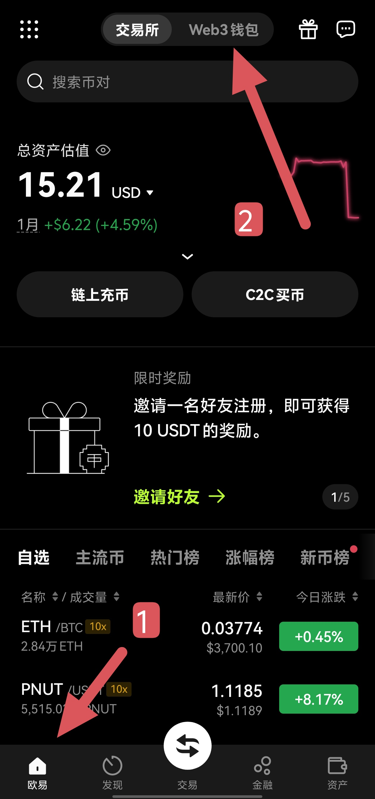
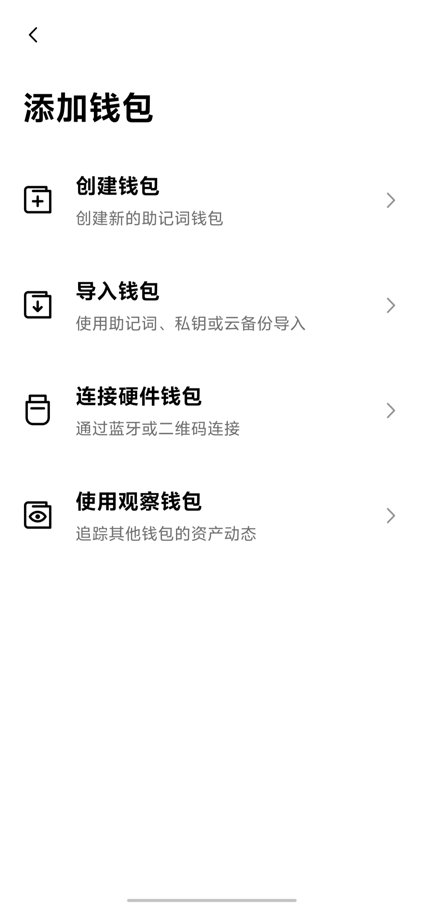
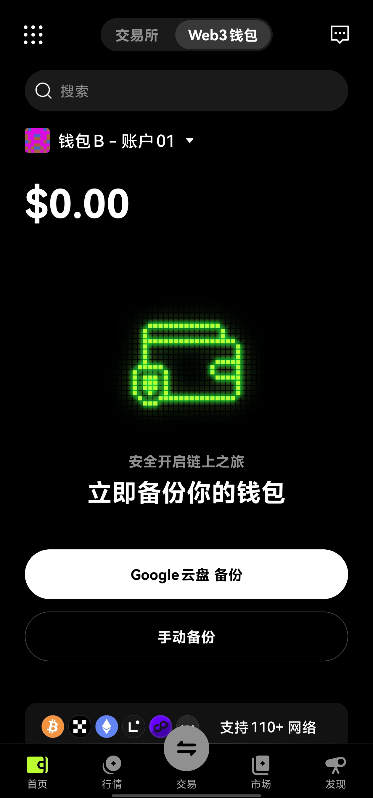
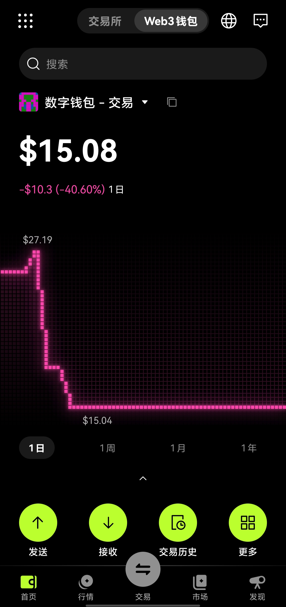
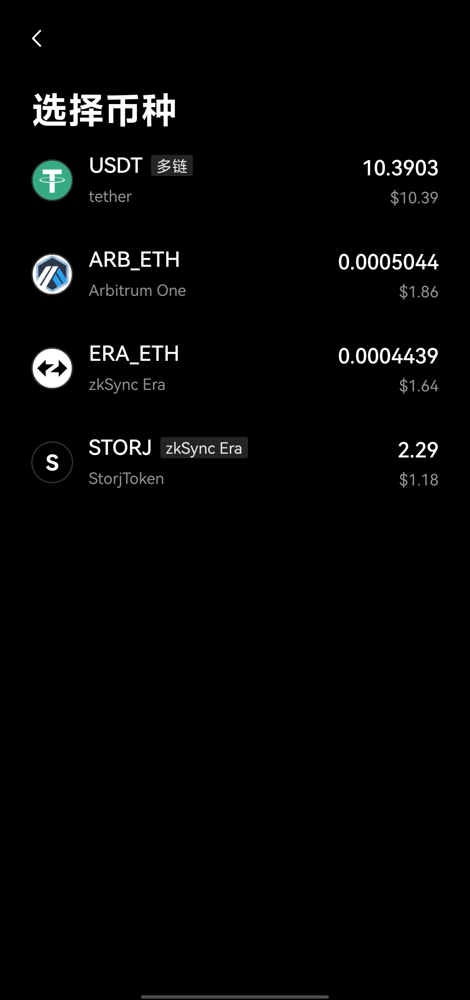
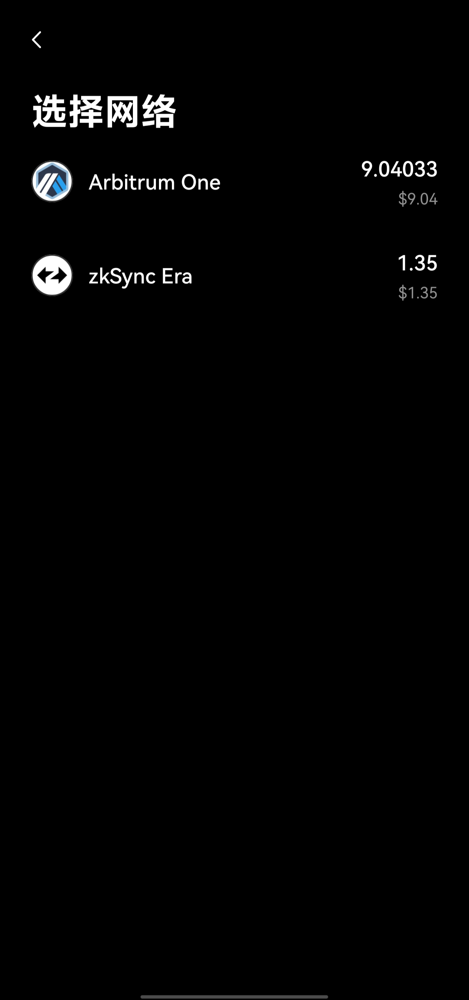
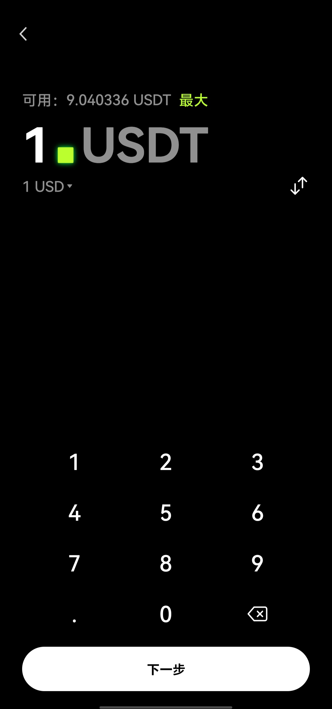
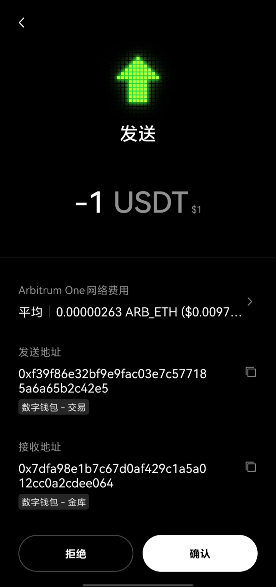

# 创建加密货币钱包

需求：

1. 需要用人民币往里面充钱并交易
2. 仅需用来收款

需求1强烈推荐创建中心化交易所账号并完成实名认证，例如欧易、币安。有平台担保，无惧入金风险。也可以额外选择创建web3钱包。

需求2可以使用任一web3钱包应用。例如：MetaMask，MyEtherWallet，TokenPocket。

注意：欧易和币安均自带开源的web3钱包。已有欧易或币安应用的可以不额外下载其他软件。笔者多个钱包软件均有使用，读者可以自己尝试，并留下使用体验最好的。

---

如果选择中心交易所，可以在官网或者Google play、苹果商店下载应用。可能需要科学上网。注册时可以选择我的邀请码，欧易`81522149` ，币安`CPA_00I2L1H2OC`。或者使用下面的邀请链接。

- [欧易邀请链接https://chouyi.army/join/81522149](https://chouyi.army/join/81522149)
- [币安邀请链接https://www.marketwebb.ac/activity/referral-entry/CPA/together-v4?hl=zh-CN&ref=CPA_00I2L1H2OC](https://www.marketwebb.ac/activity/referral-entry/CPA/together-v4?hl=zh-CN&ref=CPA_00I2L1H2OC)。

完成任务后我们双方均能获得最高等值200usdt的奖励。

---

欧易在首页顶部，点击web3钱包切换。

第一次使用钱包，选择创建钱包。应用会为你生成助记词。

记得备份助记词，最好在没有其他人和摄像头的地方抄写助记词。

一套助记词可以推导出最多100个钱包私钥。这些钱包都受你的控制。也可以单独查看某个钱包的私钥。

备份好助记词后可以开始使用钱包。

以太坊及其二层网络均使用同一个EVM（以太坊虚拟机）地址，例如笔者常用于交易的地址为`0xf39f86e32bf9e9fac03e7c577185a6a65b2c42e5` 

以太坊主网转账手续费较贵，2024年至少￥15元起步。一般使用二层网络，例如Arbitrum One，Avalanche C-Chain，Optimism，Polygon。笔者比较常用ARB，因为转账手续费较低。

向该地址转账即可收到款项。

如果想向其他地址转账，钱包内需要一些以太币作为手续费。ARB链一般手续费为￥0.1。欧易的web3钱包支持最低1usdt的eth兑换服务，大约可以交易百次左右。

发送时，点击发送按钮。

选择币种。

选择网络。

填写接受地址
填写金额

二次对比交易信息（收款方地址与金额等，永远要二次确认，确认后没有办法追回错付的款项）。

最后确认付款，等待交易被区块链网络确认。